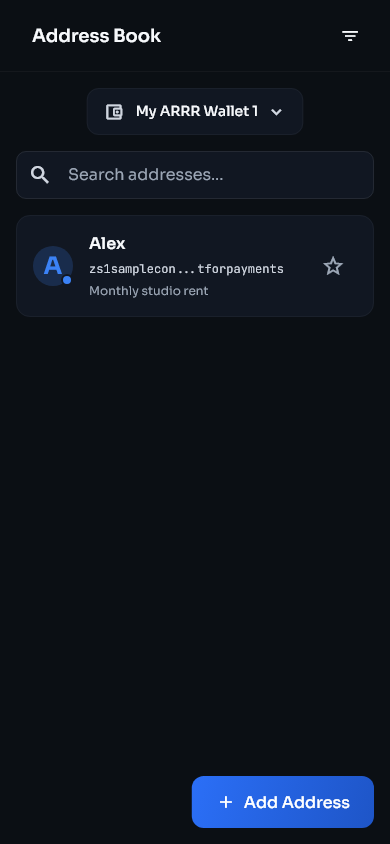
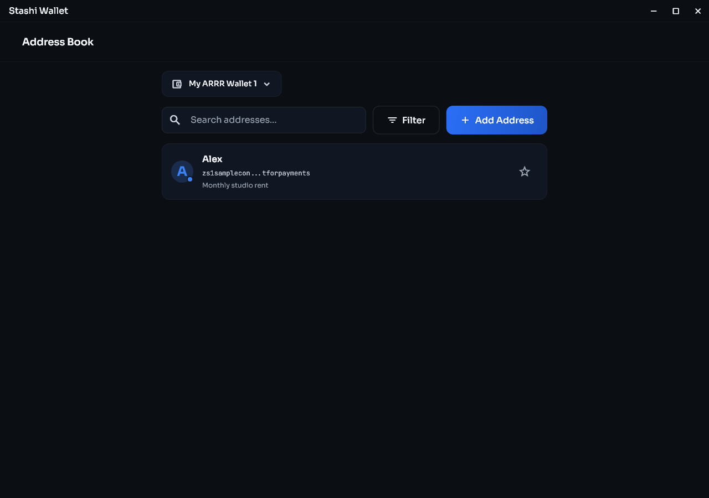
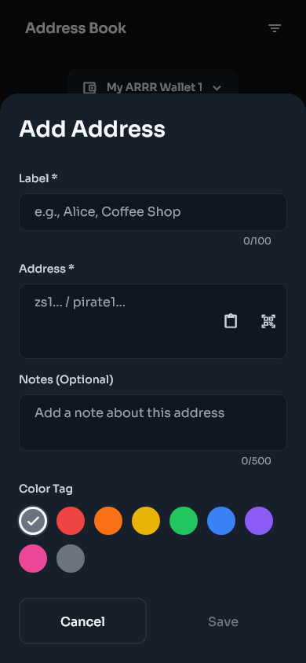
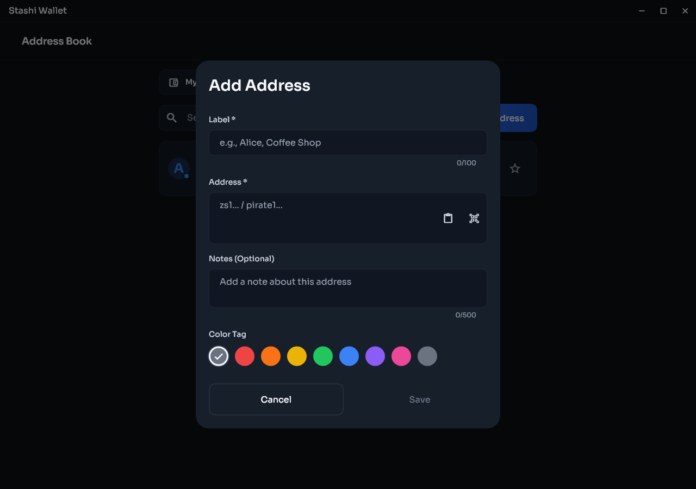
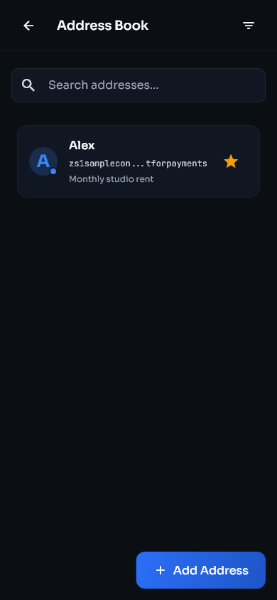
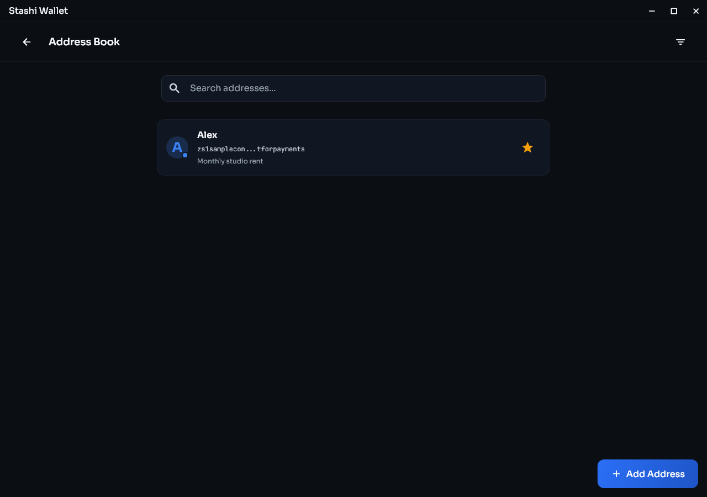

# Receive and send ARRR

[Previous: Wallet basics](wallet-basics.md) | [Guide contents](README.md) | [Next: Keys and accounts](keys-and-accounts.md)

## Receive ARRR

1. Open **Receive** from Home or Wallets.
2. Confirm the wallet and key shown on the page.
3. Generate or select the address that you want to use.
4. Add a local label if it will help you recognise the payment later.
5. Copy the address or allow the sender to scan the QR code.
6. Check that the beginning and end of the copied address match the address shown by Stashi Wallet.
7. Give the sender only the payment address or payment QR code.
8. Wait for the transaction to appear in Activity and receive confirmations.

| Mobile | Desktop |
|---|---|
|  |  |

The operating system may hide sensitive text in screenshots or screen sharing. Use the copy button in Stashi Wallet when you need the full address.

### Address rotation

Stashi Wallet can generate diversified addresses for supported keys. A new address helps prevent different payments from being linked by the address alone. Previously generated addresses remain valid.

Address labels and colour tags are local organisation tools. They are not written to the blockchain and are not sent to the payer.

<!-- page-break -->

## Send ARRR

1. Open **Send**.
2. Paste the recipient address, scan a QR code, import a QR image where supported, or select a saved contact with the **Address Book** button beside the recipient field.
3. Confirm that the address is a Pirate Chain address from the intended recipient.
4. Enter the amount.
5. Add a memo only if the recipient expects you to include a message. A memo may be visible to the recipient and to anyone who later obtains the relevant viewing authority.
6. Review the source selector. **Auto (all keys)** allows Stashi Wallet to choose spendable notes across eligible keys. Select a specific key only when you need to control the source.
7. Review the network fee and total.
8. Continue to the confirmation screen.
9. Check the address, amount, memo, fee, and source again.
10. Approve the transaction with the requested passphrase or biometric check.
11. Keep the transaction ID until the recipient confirms receipt.

| Mobile | Desktop |
|---|---|
|  |  |

Blockchain transactions cannot be cancelled after broadcast. Send a small test payment first when using a new address or sending a large amount.

## Source selection and available funds

The total wallet balance can be larger than the amount available to a selected key. If a specific source reports insufficient funds, select **Auto (all keys)** or select a source with enough confirmed spendable notes.

Pending funds, immature funds, and notes reserved by another transaction are not immediately spendable. The review screen includes the fee in the required total.

## Multiple recipients

When the Send page supports additional recipients:

1. Add a separate row for each recipient.
2. Verify every address and amount separately.
3. Confirm that the displayed total includes all outputs and the fee.
4. Remove empty or accidental rows before confirming.

## Auto consolidation

Many small notes can make transaction construction slower or exceed transaction limits. Auto consolidation can combine suitable notes during a send. It does not change wallet ownership, but it creates normal on-chain transactions and fees may apply. Review this setting under **Settings > Wallet > Auto consolidation**.

## Sweep a spending key

Sweeping moves the spendable balance controlled by a selected spending key to an address that you choose. Use it when retiring a key or consolidating custody.

1. Open **Settings > Keys & addresses**.
2. Open the spending key.
3. Select the sweep action.
4. Select all addresses or the specific source offered by Stashi Wallet.
5. Enter and verify the destination.
6. Review the full amount and fee before approving the transaction.

Do not sweep funds to a destination until you have confirmed that its seed phrase or imported spending key is backed up.

<!-- page-break -->

## Address Book

Save frequently used recipient addresses under **Settings > Address Book**. Check the wallet selector first: each wallet has its own contacts.

On Desktop, **Search**, **Filter**, and **Add Address** appear together above the list. On Mobile, the filter icon is in the top bar and **Add Address** is at the bottom.

| Mobile | Desktop |
|---|---|
|  |  |

Search matches labels, addresses, and notes. Select a contact's star to mark it as a favourite; favourites appear before other contacts. Use the filter controls to show favourites or a particular colour tag, and clear the filters to restore the full list.

The built-in general and development donation contacts appear first while marked as favourites. Selecting a contact does not send a payment.

The screenshots use a fictional contact and example address. Do not use the example address for payments.

<!-- page-break -->

## Add and manage a contact

1. Open **Settings > Address Book** and confirm the selected wallet.
2. Select **Add Address**.
3. Enter a recognisable **Label** and the recipient's **Address**. Paste the address, scan a QR code on Mobile, or import a QR image on Desktop where supported.
4. Optionally add notes and choose a colour tag.
5. Check the address against the recipient's original payment details, then select **Save**.

| Mobile | Desktop |
|---|---|
|  |  |

Open a saved contact to view its full address and notes, copy the address, or select **Edit** or **Delete**. Editing changes the label, notes, and colour tag; the saved payment address cannot be changed. Add a new contact if the recipient gives you a replacement address.

Labels, notes, favourites, and colour tags help organise your local contacts. They are not payment memos and are not sent to the recipient.

<!-- page-break -->

## Send to a saved contact

1. Open **Send** and select the **Address Book** button beside the recipient address field.
2. Search for the contact and select it to fill the recipient address.
3. Verify the full address, enter the amount and any intended memo, then continue through the normal fee and transaction review.

| Mobile | Desktop |
|---|---|
|  |  |

You can also open a contact from **Settings > Address Book** and select **Send to This Address**. Stashi Wallet opens Send with that address filled in. Always check the destination again before approving the transaction.
